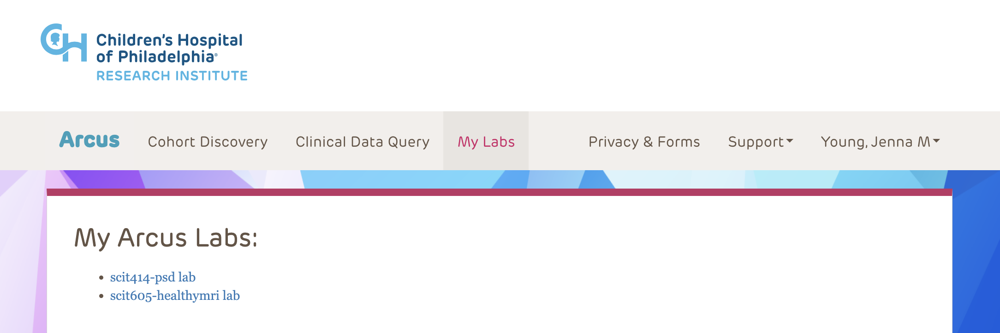
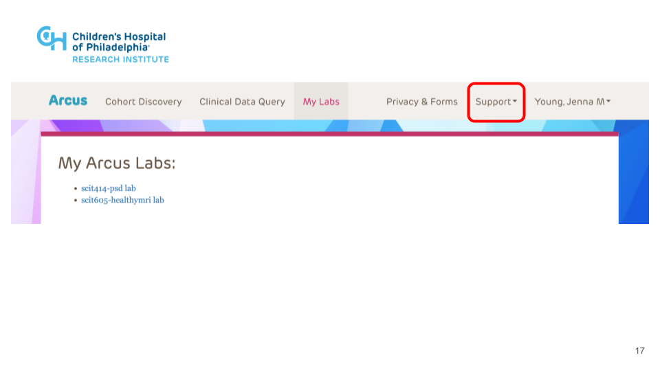
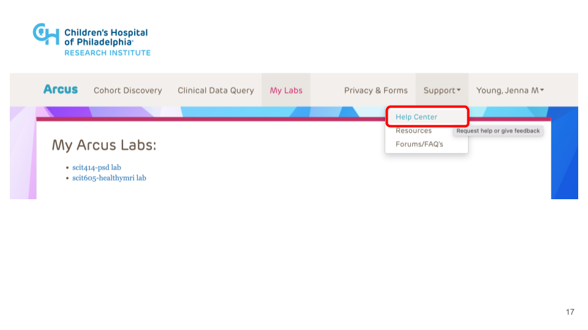
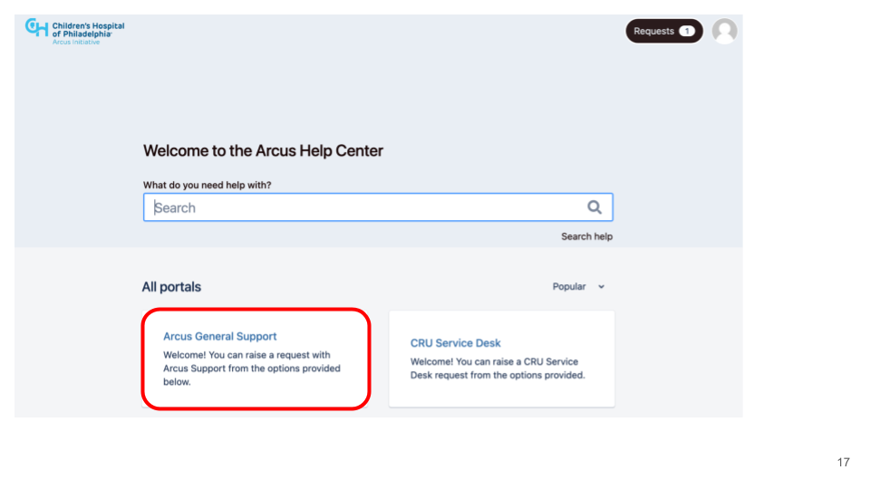

*Arcus*

A CHOP resource thhat we use for projects that involve patient information such as hospital records

## Getting up and running on Arcus

## 1. Get an Account

After you have a CHOP Research profile, username, and VPN access, e-mail Nina and Aaron and they will help you get an Arcus account.

## 2. Double check CITI training

1. Login into [Arcus](https://arcus.chop.edu). 
2. Click on your name in the upper right corner and choose "Access Status". 
3. Verify that there is a green check indicating that your CITI training completion is on file and that the training is active and has not expired. If the page indicates your CITI training is not on file or has expired, please log into your account on [https://citiprogram.org](https://citiprogram.org) and affiliate your account containing the appropriate course completion for your level of identifier access (see [Arucs CITI Training Requirement documentation](https://forum.arcus.chop.edu/t/citi-training-requirement-for-arcus/174)) with CHOP (see [How to Affiliate Yourself With CHOP at CITI](https://forum.arcus.chop.edu/t/how-to-affiliate-yourself-with-chop-at-citiprogram-org/270)).
4. Once your CITI training is active in the system, verify that you also have a green check indicating you have signed the latest version of the Arcus Terms of Use and if not, please read and sign the latest version.
 
## 3. For additional support:

**Default Option**: Create a ticket within the Arcus Help Center

To make sure your request is addressed in a timely manner, please submit a ticket via the Arcus Help Center. Include the date you would like the request to be addressed by (give the Arcus team at least 48 hours) and, if relevant, the name of the person on the Arcus team you would like to work on the ticket. (Our main contact is Scott Haag.)

[Direct link to Arcus Support](https://support.arcus.chop.edu/servicedesk/customer/portal/6/create/291)

1. In your browser, go to [https://arcus.chop.edu](https://arcus.chop.edu).
2. Log in with your eResearch credentials. 
3. The home page for Arcus will have a list of your labs under the main menu options. 

4. Click the "Support" dropdown menu

and select the "Help Center" submenu.

5. You will be taken to the Arcus Help Center webpage. To submit a ticket, select the "Arcus General Support" menu. To check the status of a previously submitted ticket, click on the "Requests" button in the top right hand corner of the screen.

This page contains a list of different categories of support tickets. Common requests include

- Data refresh: Data -> ADR -> Request Refresh
- Add a new user to a lab

**If all else fails**

For nontrivial things related to support for BGDLab Arcus Labs, e-mail Scott Haag (HAAGS@chop.edu) and cc Aaron and Jenna.
