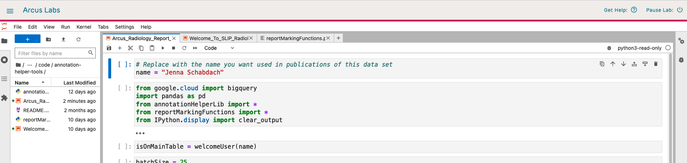
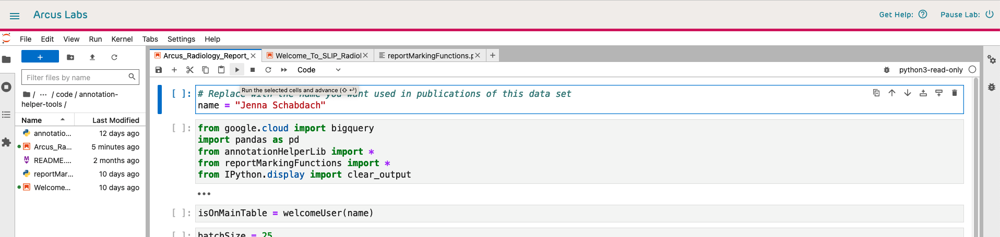
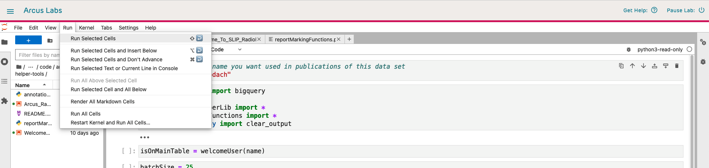
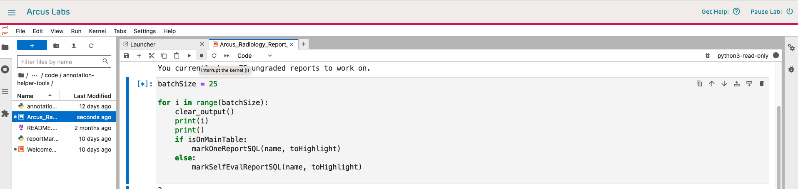
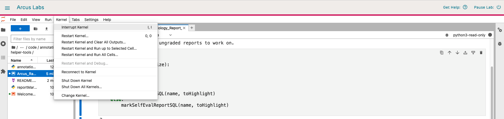
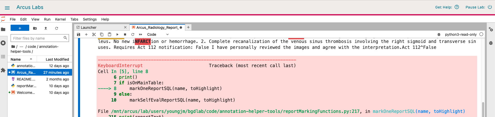
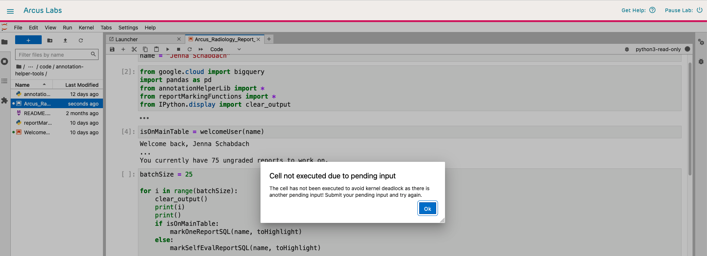
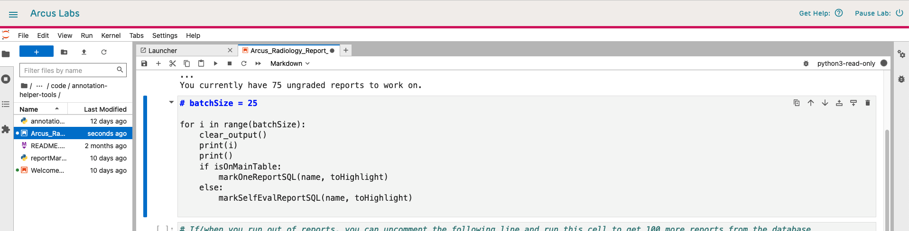
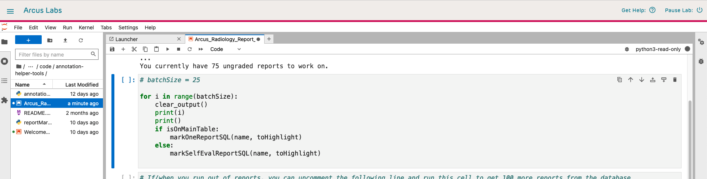

# How to use a Jupyter notebook

A Jupyter notebook is composed of different types of cells and their outputs. It is a front-end interface to a back-end kernel. This wiki page is intended to give a brief overview of how to use a notebook.

**Basic terminology**

- Cell: a chunk of code or text
- Kernel: a local server running the environment in which the code will be executed. It contains any libraries needed.
- Running a cell: execute the code (on the backend, this uses the kernel) or render the text according to Markdown format
- Markdown: a lightweight markup language for creating formatted text. Not the main focus of a notebook, but notebooks allow you to add chunks of Markdown formatted text to communicate with the user.

**Workflow**

1. Every time you open or reopen a Jupyter notebook (even on Arcus), you are starting with a clean slate. You will need to run any cells containing `import` calls or setting up variables used throughout the notebook. (In the Radiology Report Grading context, you must always run Step 0.)

2. Run a cell or group of cells. When a code cell is running or queued to run, the square brackets in front of it contain an asterisk. 

3. Once a code cell has been run, the asterisk in the square brackets in front of it transforms into a number. This number reports the order in which the cells are run. This number does not appear for Markdown cells because those cells render the formatted text rather than running code. 

## Running a cell

When you open a new Jupyter notebook (or a notebook where the outputs have been cleared), each code cell will have a pair of empty square brackets in front of it.

Running a cell executes the code (or renders the Markdown) in the cell. There a three different ways you can run a cell.

**Option 1**: the "play" button. With your desired cell selected, click the button with a right-pointing triangle in it located in the toolbar at the top of the interface.

**Option 2**: the menu bar. With your desired cell selected, click the "Run" menu and then click the "Run cell" option.

**Option 3**: keyboard controls. With your desired cell selected, press the key combination Shift + Enter.

## Stopping a running cell

There are several scenarios when you may want to stop a running cell:
- The cell contains a loop that's running longer than you want it to (infinite loops are a good example)
- You need to close the notebook in the middle of the cell running
- You ran the cell by mistake
- The cell is waiting for user input but the input box is not visible

Each of the two following options will halt the current cell, likely producing an error, but the state of the kernel is not cleared. You will need to rerun cells containing any variables modified during the now stopped cell to reset the state of those variables.

**Option 1**: the "stop" button. With your desired cell selected, click the button with a square in it located in the toolbar at the top of the interface.

**Option 2**: the menu bar. With your desired cell selected, click the "Kernel" menu and then click the "Interrupt Kernel" option.

## Understanding error messages

### Error: Keyboard Interrupt

**Cause**: a running cell was stopped. This error is no cause for alarm, the notebook is telling you that it stopped a running cell.

**Solution**: rerun the cell.

### Error: waiting for input

Sometimes shows up as one of the following
- The notebook won't let me enter anything
- I keep hitting enter on a cell that asks for user input and nothing is happening
- I tried running a cell and it's stuck with an asterisk in the square brackets in front of it

**Possible Causes**: 
- The cell was run, its type was changed, and the user tried to run the cell again without cancelling the previous run
- Arcus automatically activates labs for 8 hours, that time has passed, and the user left off in the middle of a cell with a loop

**Solution**: stop the cell using one of the methods discussed in the previou section and rerun the cell.

### Error: "I entered a number during the SLIP radiology report grading and something weird happened"

**Possible Cause**: the user input text box was not selected when the number was entered - a common issue when switching between windows or browser tabs

**Solution**:
1. Stop the cell
2. Change the type of the cell from Markdown to Code

3. If there are any `#` in front of the first line of the cell, remove them

4. Run the cell

### Error: Arcus is telling me the notebook can't connect to the kernel

**Possible Cause 1**: Arcus wants you to log in again

**Solution 1**: Keep the notebook tab open and log in via a new tab at [arcus.chop.edu](arcus.chop.edu). Then switch back to the notebook tab and dismiss the warning message. The notebook *should* allow you to resume exactly where you left off.

**Possible Cause 2**: The run time for that instance of the lab has expired.

**Solution 2**: Make sure you are logged in to Arcus and restart the lab. You will need to rerun Step 0 before resuming your report grading.
