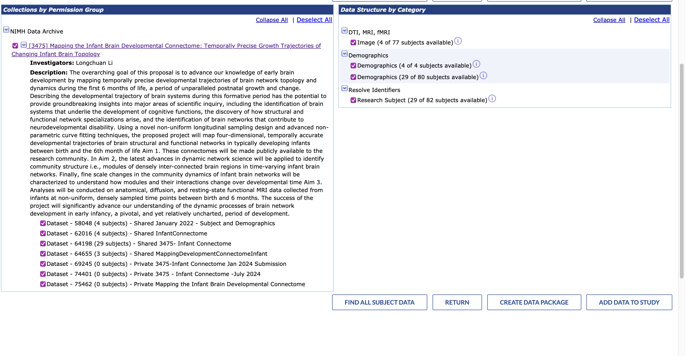
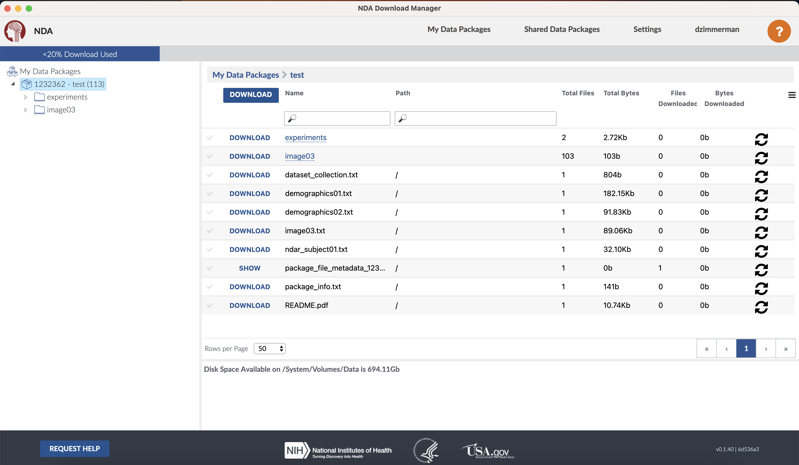

# How to download from NDA

## GUI: Download Manager
Instructions on how to download data from NDA with the Download Manager.

### Install
1. Login to your NDA account, click `TOOLS` in the top bar
2. Follow the steps to install the Download Manager

### Prep a data package 

- Log in to the website and navigate to the collection page for the study.
- Click "Add to Cart". The page will often take a moment to process the request. When the cart (upper right hand corner) has been updated with the request, it will say something like "1 filter: 1,050 subjects" and have 3 options listed. Click the "Create Data Package/Add Data to Study" option
- The data packaging page will allow you to select/deselect the measures you would like to include in the data download. When the measures you're interested in are selected, click the "Create Data Package" button.

- In the popup window, specify a name for your data package. For neuroimaging studies, make sure the checkbox next to "Include associated data files" is included. Check your selected options, then click "Create Data Package".
- The site will take you to the Data Packages page of your user profile. This page contains a table describing all of the data packages you have created. Packages are stored for approximately 2 months before being removed.
- To access this page in the future, all you need to do is log in to NDAR, click your username in the upper right hand corner of the page to view your profile, and navigate to the Data Packages page.

### Download
- Login to the Download Manager using your NDA specific username and password (not the password for the 3rd party used to login to NDA itself)
- The package created in the previous step will show up on the left hand side under "My Data Packages"
- Choose which files you want to download, click and your done!



## CLI: nda-tools
Instructions on how to use nda-tools to download NDAR datasets onto Respublica

### Source: [https://github.com/NDAR/nda-tools](https://github.com/NDAR/nda-tools)

### Install:

**Step 01**: Set up your NDAR password

Online, NDAR shifted from using NDAR accounts to using Login.gov identities. You will need to set up an NDAR account in order to use `nda-tools`. Your NDAR account is separate from your Login.gov identity.
- Log in to NDAR. You can use the Login.gov identity.
- The website will automatically load your profile page when you login.
- In the upper right corner of the profile page, click the button "Reset Password". You will be sent a link via the email on file to reset your NDA account password.
- Reset the password and save it in your password manager. You will reuse this password in **Step 04**.


**Step 02**:  Set up the `conda` environment

- `conda create -n nda-tools`
- `conda activate nda-tools`
- If pip is not installed in the conda env, `conda install -c conda-forge pip`
- `pip install numpy==1.22.4` -- there's a dependency on numpy >= 1.16 and numpy < 1.23
- If you get an error about `AttributeError: module 'pkgutil' has no attribute 'ImpImporter'. Did you mean: 'zipimporter'?`, check your python version `python --version`. 
    - So far, have confirmed this error occurs with Python `3.12` but not Python `3.9.14`. 
    - Change your Python version using `conda install python=3.9` then rerun the previous command to install numpy
- `pip install nda-tools`
- `pip install keyring` (installed from https://pypi.org/project/keyring/)
- (**Respublica ONLY**) `pip install keyrings.alt` (there is an issue on Respublica where the regular keyring package doesn't work)

**Step 03**: Check that the `keyring` works

- `python`
- `import keyring`
- (*Respublica ONLY*) `import keyrings.alt`
- `keyring.set_password("thisisasillytest", 'iam', 'groot')`  
    - This is where errors often happen on Respublica. Those errors likely have to do with the keyring automatically setting a password for the keyring:
    - In the terminal, run the command `rm ~/.local/share/keyring/*`
    - Then run `python`, `import keyring`, (*Respublica ONLY*) `import keyrings.alt`
    - Change the backend: `keyring.core.set_keyring(keyring.core.load_keyring('keyrings.alt.file.PlaintextKeyring'))` *(Note: this backend is not recommended for production use - it's not a secure way to store usernames/passwords - but it's what was recommended by Respublica)*
    - Now try setting the password again: `keyring.set_password("thisisasillytest", "iam", "groot")`
    - The system (at least on Respublica) will prompt you to create a new password for the keyring
- `keyring.get_password("thisisasillytest", 'iam')` will return `'groot'`
- `exit()`

**Step 04**: Add your NDA username and password to the `keyring`

- Make sure you know your NDA username and password (https://nda.nih.gov/nda/creating-an-nda-account.html). You may need to reset your password from your NDA account page.
- Checking the source name:
    - Exit python
    - Run a `downloadcmd` command without the correct password and see which file in the NDATools site package is the source of the error:  `File "/Users/youngjm/opt/miniconda3/envs/ndatools/lib/python3.9/site-packages/NDATools/clientscripts/downloadcmd.py", line 177, in configure`
    - I traced the relevant file back to `./miniconda3/envs/ndatools/lib/python3.9/site-packages/NDATools/Configuration.py`. SERVICE_NAME is defined on line 58 as `'nda-tools'`
- `python`
- `import keyring`
- (*Respublica ONLY*) `import keyrings.alt`
- `keyring.set_password("nda-tools", "NDAR_USERNAME", "pass")`
- `keyring.get_password("nda-tools", "NDAR_USERNAME")`


**Step 05**: Prep a data package on [https://nda.nih.gov](https://nda.nih.gov)

- Log in to the website and navigate to the collection page for the study.
- Click "Add to Cart". The page will often take a moment to process the request. When the cart (upper right hand corner) has been updated with the request, it will say something like "1 filter: 1,050 subjects" and have 3 options listed. Click the "Create Data Package/Add Data to Study" option
- The data packaging page will allow you to select/deselect the measures you would like to include in the data download. When the measures you're interested in are selected, click the "Create Data Package" button.
- In the popup window, specify a name for your data package. For neuroimaging studies, make sure the checkbox next to "Include associated data files" is included. Check your selected options, then click "Create Data Package".
- The site will take you to the Data Packages page of your user profile. This page contains a table describing all of the data packages you have created. Packages are stored for approximately 2 months before being removed.
- To access this page in the future, all you need to do is log in to NDAR, click your username in the upper right hand corner of the page to view your profile, and navigate to the Data Packages page.


**Step 06**: Download the data package

- For the data package you wish to download, copy the ID number in the first column. Make sure there is enough space in the destination to store the downloaded files.
- On Respublica, run the following script with your arguments via bash (or submit to slurm by replacing the `bash` command with `sbatch`): `bash /mnt/isilon/bgdlab_resnas03/Data/LBCC/template_code/ndaDownloadSubmit.sh 12345678 ndarUsername /path/to/destination/` where
    - `12345678` is the desired Data Package's ID
    - `ndarUsername` is your NDA username
    - `/path/to/destination/` is the full path to the location where you want to store the data download

### Contents of `ndaDownloadSubmit.sh`:

```
#!/bin/bash

#SBATCH -N 1
#SBATCH -n 16
#SBATCH --mem=100G
#SBATCH --time=7-00
#SBATCH --job-name=ndar-download

PACKID=$1 # package ID found on NDA download page
USRNAME=$2 # NDAR username found on NDA user profile
TARGETDIR=$3 # destination of downloaded data

# Set up ndatools
source ${HOME}/miniconda3/etc/profile.d/conda.sh
conda activate nda-tools

# Initial download
downloadcmd -dp $PACKID -u $USRNAME -d $TARGETDIR -wt 32

# Verify the download
downloadcmd -dp $PACKID -u $USRNAME -d $TARGETDIR --verify

# Download any files that were missed the first time
VERIFYDIR=~/NDA/nda-tools/downloadcmd/packages/$PACKID
downloadcmd -dp $PACKID -u $USRNAME -d $TARGETDIR -wt 32 -t $VERIFYDIR/downlaod-verification-retry-s3-links.csvj

```


### References:


Last updated 2024-09-05 dabrielz

**Contributors**

@jmschabdach

@dabrielz
