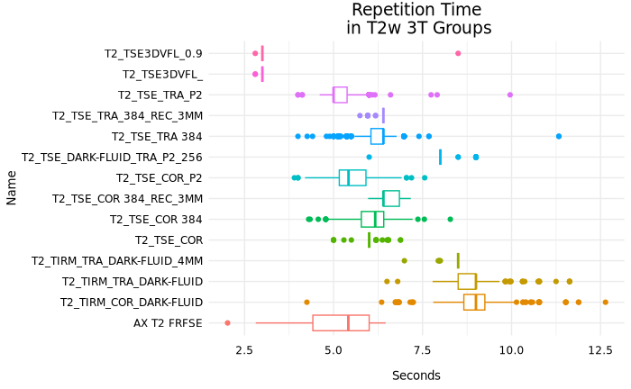
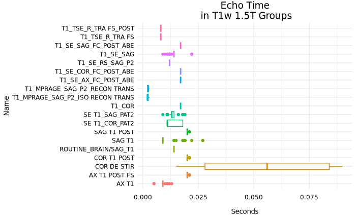
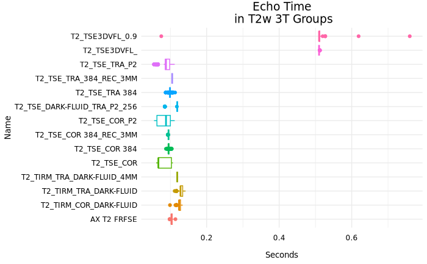
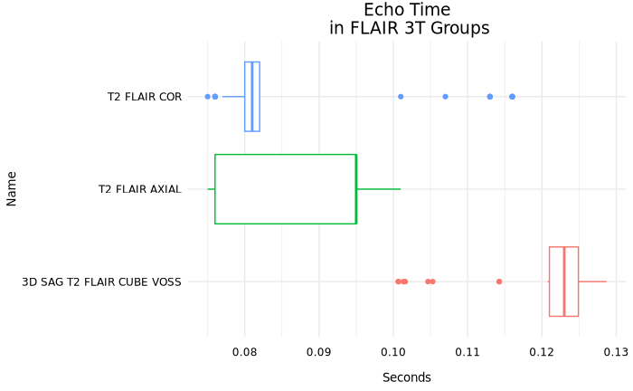

# Heterogenity in scan groups
The following plots show the variability of a single parameter for each protocol group. In brief, **MPRAGE** protocols are highly similar across all parameters whereas **TSE** protocols are more variable and protocols where an acquisition type isn't mentioned (i.e. SAG T1) usually have the highest variability.
* [RepetitionTime](#repetitiontime)
* [EchoTime](#echotime)
* [FlipAngle](#flipangle)
* [PixelBandwidth](#pixelbandwidth)
* [PercentSampling](#percentsampling)
* [MultibandAccelerationFactor](#multibandaccelerationfactor)

##### RepetitionTime
###### T1w

###### T2w

###### FlAIR

##### EchoTime
###### T1w

###### T2w

###### FLAIR

##### FlipAngle
###### T1w

###### T2w

###### FLAIR

##### PixelBandwidth
###### T1w

###### T2w

###### FLAIR

##### PercentSampling
###### T1w

###### T2w

###### FLAIR

##### MultibandAccelerationFactor
###### T1w

###### T2w

Last updated 2024-09-27 by dabrielz