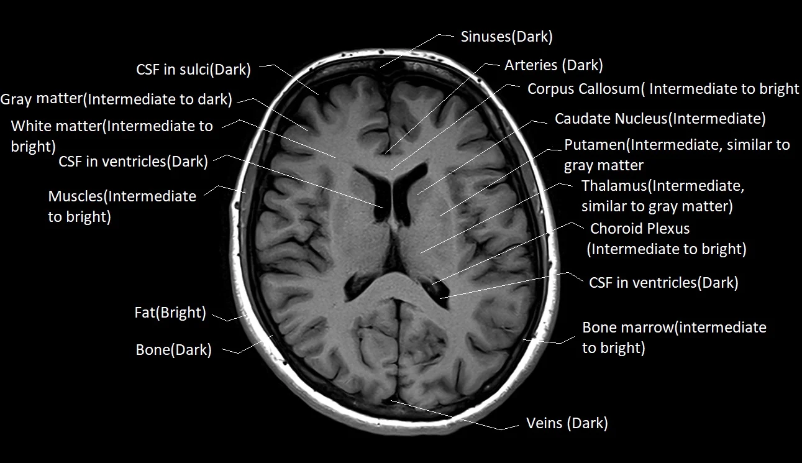
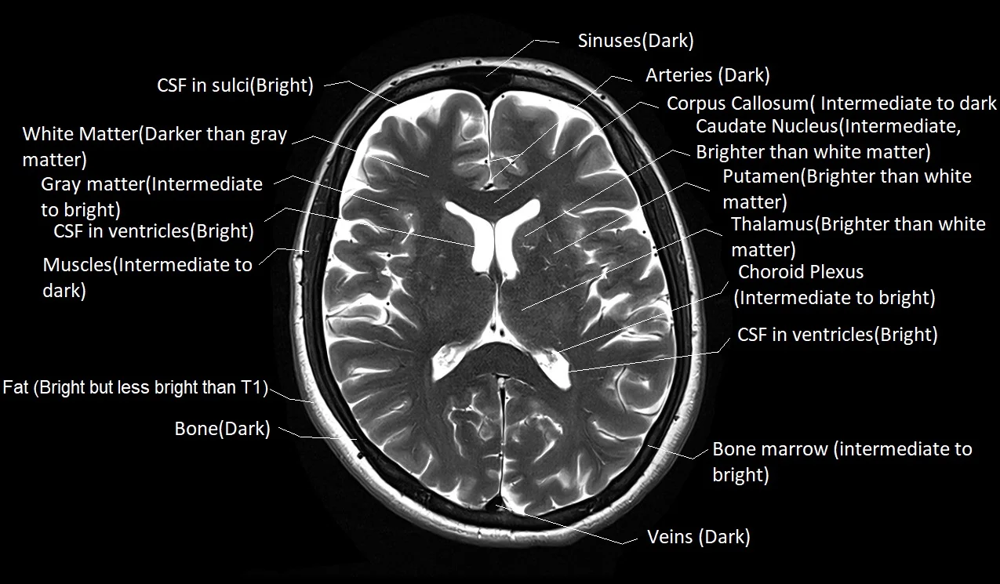
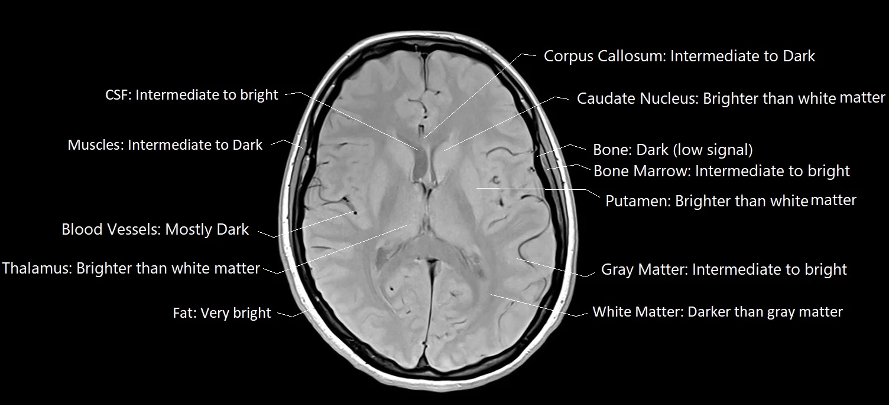
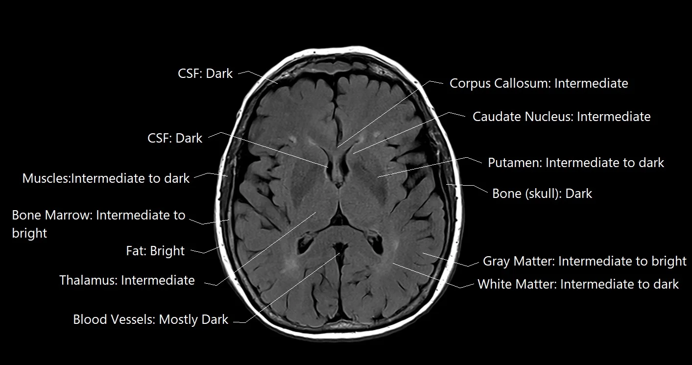
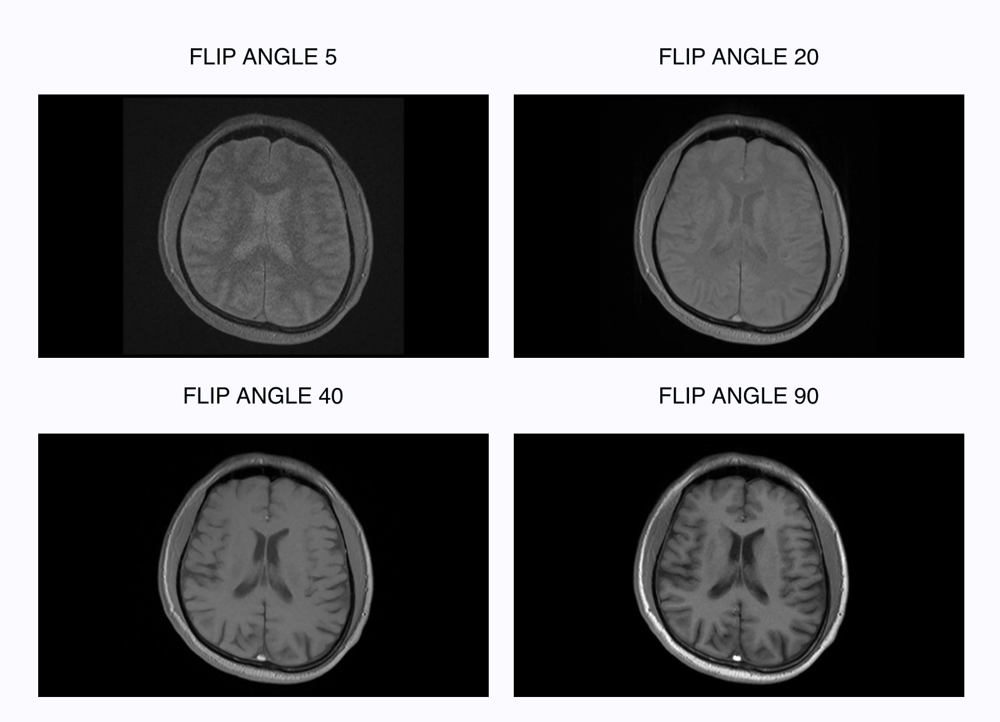
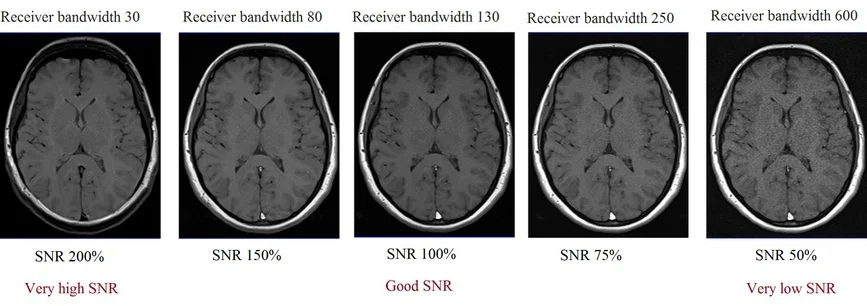

# Scan Identification

* [Background](#background)
* [Contribution of Metadata to Image Signal](#contribution-of-metadata-to-image-signal)
* [Metadata Informed Scan Identification Process](#metadata-informed-scan-identifcation-process)
* [Data Dictionaries](#data-dictionaries)
* [Sequence Dictionary](#sequences)
* [Helpful Resources](#helpful-resources)

## Background
Scans delivered from CHOP arrive in dicom format. Data is converted to nifti using [heudiconv](https://heudiconv.readthedocs.io/en/latest/) (relies on dcm2niix) where scans were identified(named) based on the `SeriesDescription` or `ProtocolName` metadata fields containing explicit mention of various sequence or scan types:
* T1w
    * Sequence: tse, spgr, mpr
    * Scan: t1w
* T2w
    * Scan: t2w
* FLAIR
    * Scan: flair
* DWI
    * Scan: ep2d, dti

CHOP's standardized MPR scans would then be identified using [CuBIDS](https://cubids.readthedocs.io/en/latest/about.html) and a python script based on these criteria:
* `MPRStandarized`
    * RepetitionTime = 2.05
    * VoxelSizeDim3 = 0.9
    * ProtocolName = "T1 MPR SAG 0.9 MM"
* `MPRStandarizedVariant`
    * RepetitionTime = 2.05
    * VoxelSizeDim3 = 0.9

 `ProtocolName` and `SeriesDescription` are both character strings that can be changed by the scanner operator, leading to an large amount of very small variations (see examples below) and general non-descriptiveness, so it is more reliable to use metadata in the dicoms. Additionally, we want forwards compatability, meaning with each new delivery of data, we want to classify scans with `ProtocolName` or `SeriesDescription` that we have never encountered before.  

* Some non-descriptive examples
    * routine_brain/mts_trans
    * routine_brain_1_to_2_years
    * ax gre
    * sag fspgr

## Contribution of Metadata to Image Signal
Our data includes T1w, T2w, FLAIR, PDw, PDT2, DWI, EP2D type images. [Image comparison resource](https://mrimaster.com/t1-vs-t2-vs-pd-vs-flair-mri/)

### TR and TE
Great resource for understanding TR and TE: [link](https://mrimaster.com/tr-and-te-in-mri/)
In brief:
* **T1w** = short TR and TE
* **T2w** = longer TR and TE
* **PD** scans = long TR and short TE
* **FLAIR** = longest TR and TE

###### T1w

###### T2w

###### PDw

###### FLAIR

### Flip Angle
[Explanation of Flip Angle](https://mrimaster.com/flip-angle/#:~:text=A%20greater%20flip%20angle%20corresponds,leading%20to%20a%20darker%20image.)
`FlipAngle` contributes to the brightness of an image. It is a value in degrees between 0 and 180 representative of the angle in which the magnetic field was applied. A higher degree `FlipAngle` = brighter image, lower degree `FlipAngle` = darker image

`FlipAngle` is also associated with `Signal-to-Noise Ratio` and `Specific Absorption Rate` (as one increases so do the others).

### Pixel Bandwidth
[Great resource for understanding bandwidth](https://mrimaster.com/technique-bandwidth/). The `PixelBandwidth` is equivalent to the Receiver Bandwidth which can be adjusted at the scanner console reflective of the quality of the MR signal. Bandwidth and SNR are inversely proportional, higher bandwidth decreases SNR. 
> The receiver bandwidth refers to the range of frequencies utilized during the reception of RF pulses.

### Percent Sampling
Fraction of acquired acqusition matrix lines. 

### Multiband Acceleration Factor
Number of slice obtained simultaneously (i.e. value of 4 means 4 slices taken at the same time). Reduces scan time. 

### Fat Saturation

### Magnetization Transfer

---

## Metadata Informed Scan Identifcation Process
In order to reliabily classify a scan that might have a non-descriptive or misclassified `ProtocolName` and/or `SeriesDescription`, metadata scrubbed from the dicoms is used to classify a scan into a general scan type (T1w, T2w, FLAIR) and then into a more specific sequence (i.e. TSE T1w, TIRM T2w) based on these fields:
* `RepetitionTime`
* `EchoTime`
* `FlipAngle`
* `ImageOrientation`
* `PixelBandwidth`
* `PercentSampling`
* `MultibandAccelerationFactor`

Scans do not always have all of the above fields present due to a variety of reasons like year of scan (`MultibandAccelerationFactor` is a result of newer techniques, some older scanners generally output less metadata), scanner manufacturer, etc. At minimum, we expect any scan to have `RepetitionTime` and `EchoTime`. The general process for scan identification is described below.
1. [Group Identification](#group-identification)
2. [Parameter Review](#parameter-review)
3. [Classifier Updates](#classifier-updates)
4. [Performance Evaluation]()

### Group Identification
Scan groups were created based on the most common `ProtocolNames` in the data. These groups can be found in the [parameter ranges table](https://github.com/BGDlab/dataorg-arcus/blob/main/step_03/parameter_ranges.tsv). Data was first segmentation by field strength (3T versus 1.5T) and by scan type (T1w, T2w, and FLAIR).

### Parameter Review

The metadata fields were chosen in order to distinguish scans belonging to one group from scans belonging to another group. Originally, many metadata fields were considered. These fields were pruned away based on how heterogenous the values were across all scans in that one group. For example, for `RepetitionTime`, did the majority of scans in that group have the same exact *TR*? If not, were the majority of *TR*s a few milliseconds away from the mode (most common value) or were they 4 or 5 second away from the mode? Consider the examples below, the 2 scan groups have very homogenous `PixelBandwidth` but highly variable `RepetitionTime` as only 34% and 15% of scans in those groups have a *TR* within 5 msec of the mode. 

|Group         |RepetitionTime Mode  |% of Scans |PixelBandwidth Mode|% of Scans |
|:-------------|--------------------:|----------:|------------------:|----------:|
|T2_TSE_COR 384|0.099                |34         |205                |99         |
|T2_TSE_TRA 384|0.095                |15         |205                |99         |

*TR* is an essential parameter in distinguishing scan types so even though its highly heterogenous in the examples, it is retained. Other fields that were highly heterogenous were discarded. The figures below will show heterogenity in the retained parameters. In the example it is also shown that while homogenous, `PixelBandwidth` is the same between the two groups so it isn't useful for distinguishing these groups apart from each other (mainly because they are both TSE sequences). 

Surviving parameters: 
* `RepetitionTime`
* `EchoTime`
* `FlipAngle`
* `ImageOrientation`
* `PercentSampling`
* `PixelBandwidth`
* `MultibandAccelerationFactor`

Evaluate the heterogenity within each parameter here: [Parameter Plots](parameter_plots.md)

### Classifier Updates
The initial classifer function only identified and labelled CHOP standard MPRAGE with an exact `RepetitionTime` of 2.05, exact `VoxelSizeDim3` of 0.9, and exact `ProtocolName` of "T1 MPR SAG 0.9 MM". If scans passed the first two filters and the `ProtocolName` contained the substring listed previously, it was labelled as a "StandardizedVariant". To be able to identify scans that resemble one of the groups defined in the previous step, the classifer function had to be updated to allow for filters for all parameters that survived the parameter review step. Additional, a range had to be determined in order to identify scans that very closely matched the pre-defined group parameters ("StandardizedVariant") and as scans that loosely matched the pre-defined group parameters ("Variant"). 

* Initial filters require an input scan to first match to a group's field strength (3T or 1.5T)

* Then:
    * **"StandardizedVariant"** scan matches to a single protocol group based on:
        * `RepetitionTime` within *0.05* s of the group's value mode
        * `EchoTime` within *0.01* s of the group's value mode
        * `FlipAngle` exactly the first or second most common value for the group, or the parameter doesn't exist in the scan metadata
        * `PercentSampling` exactly the first or second most common value for the group, or the parameter doesn't exist in the scan metadata
        * `PixelBandwidth` exactly the first or second most common value for the group, or the parameter doesn't exist in the scan metadata
        * `MultibandAccelerationFactor` exactly the first or second most common value for the group, or the parameter doesn't exist in the scan metadata

    * **"Variant"** scan matches to a single protocol group based on all the same above factors, except:
        * `RepetitionTime` within *0.5* s of the group's value mode
        * `EchoTime` within *0.05* s of the group's value mode

### Performance Review
Evaluating the performance of the classifer was necessary to ensure that:
* No cross scan type classification (clearly T1w scan passing through filters for a T2w scan group)
* No multi-group classification (no 1 scan being classifed as 2 different groups, i.e. TSE and MPRAGE)

Input data was the same used to define the initial groups. 

#### Example
Consider a scan (done at 1.5T that wasn't included in the original data to define the groups) with a non-descriptive `ProtocolName` of **ROUTINE_BRAIN_CONTINUED/CO** with the following parameters:
* `RepetitionTime` = 6.0
* `EchoTime` = 0.097
* `FlipAngle` = 180
* `ImageOrientation` = LSP+
* `PercentSampling` = 100
* `PixelBandwidth` = None
* `MultibandAccelerationFactor` = 30

We could infer that this probably isn't a T1w or FlAIR, but can't really know if its T2w or PDw. Putting this scan through the classifer, we see that it matches into a TSE T2w scan group (specifically **ROUTINE_BRAIN/COR_TSE_T2** group) with the following definitions:
* `RepetitionTime` = 6.0
* `EchoTime` = 0.099
* `FlipAngle` = 180
* `ImageOrientation` = LSP+
* `PercentSampling` = 100
* `PixelBandwidth` = None
* `MultibandAccelerationFactor` = 30

Now we have classifed a previously "unknown" scan using only metadata!

## Data Dictionaries
This section will list all of what can show up in clincal data organized after September 2024. 

### Sample
* BIDS pair: `sample-fetal`
* Fetal neuro scans

### Fat Saturation
* **FatSat** at the end of the BIDS pair: `acq-<value>`
    * [T1 FS](https://mrimaster.com/characterise-image-t1-fat-sat/)
    * [T2 FS](https://mrimaster.com/characterise-image-t2-fat-sat/)

### Reconstruction Methods
* BIDS pair: `rec-<value>`
* Values:
    * PROPELLER
        * [reference](https://mriquestions.com/propellerblade.html)
        * Periodically Rotated Overlapping ParalleL Lines with Enhanced Reconstruction
    * NORM
        * Intensity normalization
    * DIS2D
        * Distortion correction in 2D
    * DIS3D
        * Distortion correction in 3D
    * MFSPLIT
    * FIL 
        * In-line filter

### Sequences
* BIDS pair: `acq-<value>`
* Values:
    * MPRAGE
        * Magnetization Prepared Rapid Gradient Echo Imaging
    * BLADE
        * [Siemens](https://www.siemens-healthineers.com/en-us/magnetic-resonance-imaging/options-and-upgrades/clinical-applications/syngo-blade)
        * [Reference](https://mrimaster.com/blade-propeller/)
        * Balanced Steady State Free Precession Line Acquisition with Undersampling
    * TSE
        * Turbo Spin Echo
    * GE
        * Gradient Echo
    * SE
        * Single Echo
    * HASTE/SSFSE
        * [Reference](https://mriquestions.com/hastess-fse.html)
        * **HASTE**: Half-Fourier Acquisition Single-shot Turbo spin Echo imaging (Siemens)
        * **SS-FSE**: Single-shot fast spin echo (GE)
    * SPACE
        * [Reference](https://mriquestions.com/spacecubevista.html)
    * CUBE
        * [Reference](https://mriquestions.com/spacecubevista.html)
    * VISTA
        * [Reference](https://mriquestions.com/spacecubevista.html)
    * VIBE
        * [Reference](https://mrimaster.com/characterise-image-vibe/)
    * TIRMDARK
        * [Reference](https://radiopaedia.org/articles/turbo-inversion-recovery-magnitude-1?lang=us)
        * Turbo Inversion Recovery Magnitude
    * TIRMDARKIPAT
        * [TIRM DARK reference](https://radiopaedia.org/articles/turbo-inversion-recovery-magnitude-1?lang=us) and [iPAT Extensions](https://www.siemens-healthineers.com/en-us/magnetic-resonance-imaging/options-and-upgrades/clinical-applications/ipat-extensions)
    * FL2D/SPGR/FLASH/FFE
        * [Reference](https://www.ncbi.nlm.nih.gov/pmc/articles/PMC4588759/)
        * **FL2D/FLASH**: 2-dimensional fast low angle shot (Siemens)
        * **SPGR**: spoil gradient recalled echo (GE)
        * **FFE**: T1-fast field echo  (Philips)
            * This can sometimes show up in the `ImageType` field 
    * FL3D
        * **FL3D/FLASH**: 3-dimensional fast low angle shot (Siemens)
    * MTS
        * [Reference](https://s.mriquestions.com/mt-imagingcontrast.html)
        * Magnetization Transfer Saturation
    * FSGPRBRAVO
    * FSPGR
    * TSE3DVFL
    * TSEP2
    * MEMP
    * FSE
    * SEPAT2
    * PDT2
    * TIRM
    * STIR
        * [Reference](https://mrimaster.com/characterise-image-stir/)
        * Short Tau Inversion Recovery
    * FL3D
    * SPC
    * CINE
    * DIXON
    
### Suffix
* Values:
    * structural 
        * T1w
        * T2w
        * T2starw
            * [Reference](https://mrimaster.com/t2-star-mri/)
        * FLAIR
            * Fluid Attentuated Inversion Recovery
            * [T1 v T2 FLAIR](https://mrimaster.com/characterise-image-flair/)
        * PDw
            * Proton density weighted 
    * susceptibility
        * swi
    * diffusion
        * dwi
        * ep2d
    * other
        * unknown

        
---

## Helpful Resources

### General
* [What is a nifti?](https://brainder.org/2012/09/23/the-nifti-file-format/)
* [Common Abbrevations Dictionary](https://radiopaedia.org/articles/mri-pulse-sequence-abbreviations?lang=us)
* [What is Inversion Time](https://mrimaster.com/ti-mri/)
* [What is SNR](https://mrimaster.com/snr/)
* [Magnetization Transfer Contrast](scan_identification/de_boer1.pdf)
* [Cross Vendor Terms](https://mrimaster.com/mri-acronyms/)

#### Manufacturer Specific Guides
##### Siemens
* [Syngo DICOM Conformence Statement](scan_identification/siemens_syngo_info.pdf)
* [FSPGR With IR Prep](https://mriquestions.com/ir-prepped-sequences.html)
* [iPAT Extensions](https://www.siemens-healthineers.com/en-us/magnetic-resonance-imaging/options-and-upgrades/clinical-applications/ipat-extensions)
* [Siemens MR Glossary](scan_identification/MRGlossary.pdf)
##### GE

Last updated 2024-09-27 by dabrielz
