# Scan Identification

* [Background](#background)
* [Dictionaries](#dictionaries)
* [Sequence Dictionary](#sequences)
* [Helpful Resources](#helpful-resources)

## Background
Scans delivered from CHOP arrive in dicom format. Data is converted to nifti using [heudiconv](https://heudiconv.readthedocs.io/en/latest/) (relies on dcm2niix) where scans were identified(named) based on the `SeriesDescription` or `ProtocolName` metadata fields containing explicit mention of various sequence or scan types:
* T1w
    * Sequence: tse, spgr, mpr
    * Scan: t1w
* T2w
    * Scan: t2w
* FLAIR
    * Scan: flair
* DWI
    * Scan: ep2d, dti

CHOP's standardized MPR scans would then be identified using [CuBIDS](https://cubids.readthedocs.io/en/latest/about.html) and a python script based on these criteria:
* `MPRStandarized`
    * RepetitionTime = 2.05
    * VoxelSizeDim3 = 0.9
    * ProtocolName = "T1 MPR SAG 0.9 MM"
* `MPRStandarizedVariant`
    * RepetitionTime = 2.05
    * VoxelSizeDim3 = 0.9

 `ProtocolName` and `SeriesDescription` are both character strings that can be changed by the scanner operator, leading to an large amount of very small variations (see examples below) and general non-descriptiveness, so it is more reliable to use metadata in the dicoms. Additionally, we want forwards compatability, meaning with each new delivery of data, we want to classify scans with `ProtocolName` or `SeriesDescription` that we have never encountered before.  

* Some non-descriptive examples
    * routine_brain/mts_trans
    * routine_brain_1_to_2_years
    * ax gre
    * sag fspgr

## Metadata Informed Scan Identifcation Process
In order to reliabily classify a scan that might have a non-descriptive or misclassified `ProtocolName` and/or `SeriesDescription`, metadata scrubbed from the dicoms is used to classify a scan into a general scan type (T1w, T2w, FLAIR) and then into a more specific sequence (i.e. TSE T1w, TIRM T2w) based on these fields:
* `RepetitionTime`
* `EchoTime`
* `FlipAngle`
* `ImageOrientation`
* `PixelBandwidth`
* `PercentSampling`
* `MultibandAccelerationFactor`

Scans do not always have all of the above fields present due to a variety of reasons like year of scan (`MultibandAccelerationFactor` is a result of newer techniques, some older scanners generally output less metadata), scanner manufacturer, etc. At minimum, we expect any scan to have `RepetitionTime` and `EchoTime`. The general process for scan identification is described below.
1. [Group Identification](#group-identification)
2. [Parameter Review]()
3. [Classifier Updates]()
4. [Performance Evaluation]()

### Group Identification
Scan groups were created based on the most common `ProtocolNames` in the data. These groups can be found in the [parameter ranges table](https://github.com/BGDlab/dataorg-arcus). 

### Parameter Review

The metadata fields were chosen in order to distinguish scans belonging to one group from scans belonging to another group. Originally, many metadata fields were considered. These fields were pruned away based on how heterogenous the values were across all scans in that one group. For example, for `RepetitionTime`, did the majority of scans in that group have the same exact *TR*? If not were the majority of *TR*s a few milliseconds away from the mode (most common value) or were they 4 or 5 second away from the mode? Consider the examples below, the 2 scan groups have very homogenous `PixelBandwidth` but highly variable `RepetitionTime` as only 34% and 15% of scans in those groups have a *TR* within 5 msec of the mode. 
| Group | RepetitionTime Mode | % of Scans|PixelBandwidth Mode| % of Scans|
|------:|------|------|------|:------:|
|T2_TSE_COR 384|0.099|34|205|99|
|T2_TSE_TRA 384|0.095|15|205|99|

*TR* is an essential parameter in distinguishing scan types so even though its highly heterogenous in the examples, it is retained. Other fields that were highly heterogenous were discarded. The figures below will show heterogenity in the retained parameters. In the example it is also shown that while homogenous, `PixelBandwidth` is the same between the two groups so it isn't useful for distinguishing these groups apart from each other (mainly because they are both TSE sequences). 

#### Contribution of Metadata to Image Signal (T1w v T2w v FLAIR)

#### Heterogenity in scan groups
##### RepetitionTime
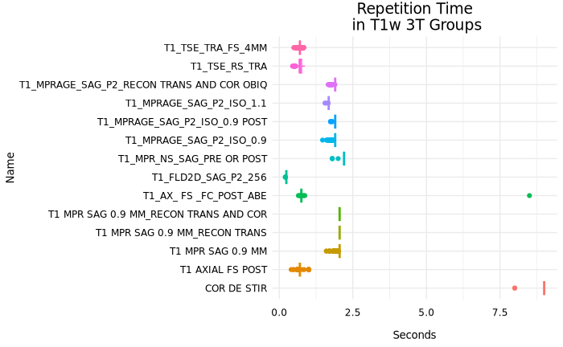
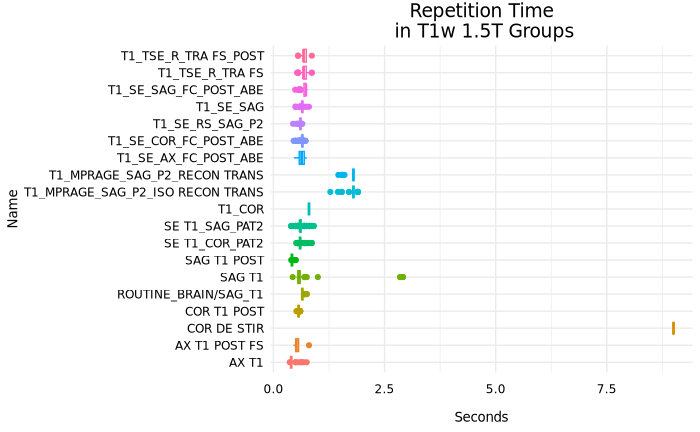
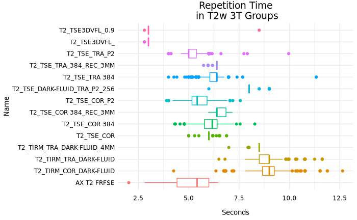
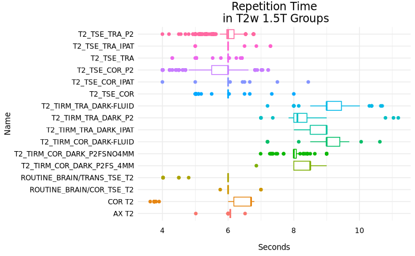
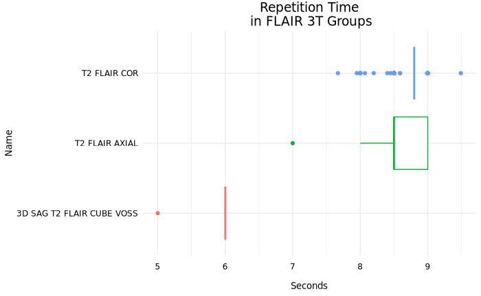

##### EchoTime
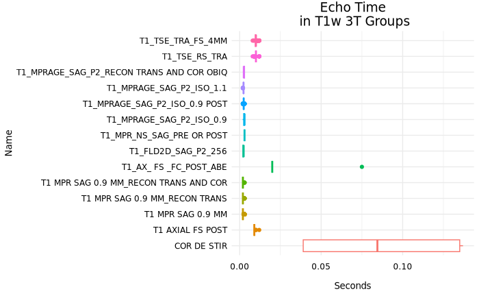
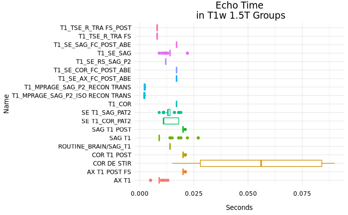
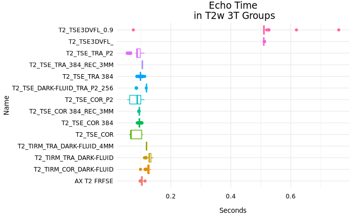
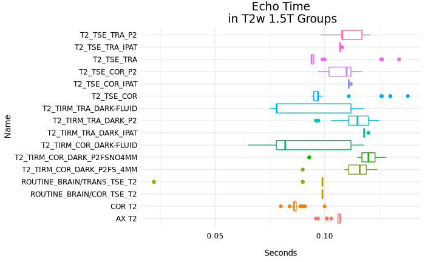
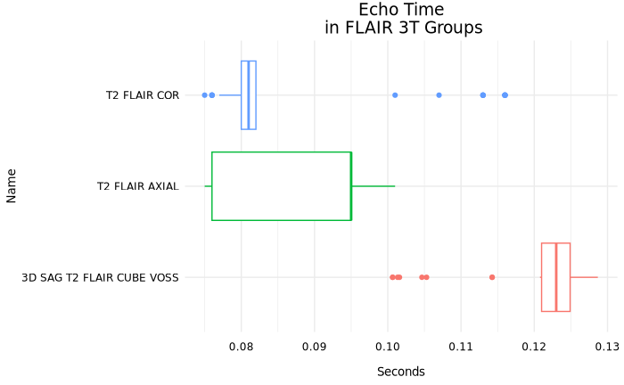

##### FlipAngle
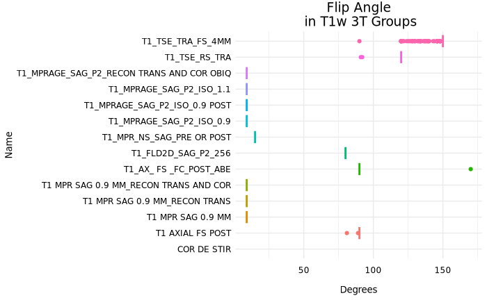
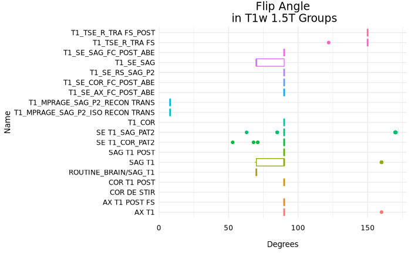
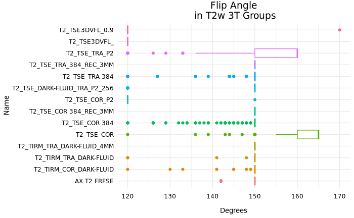
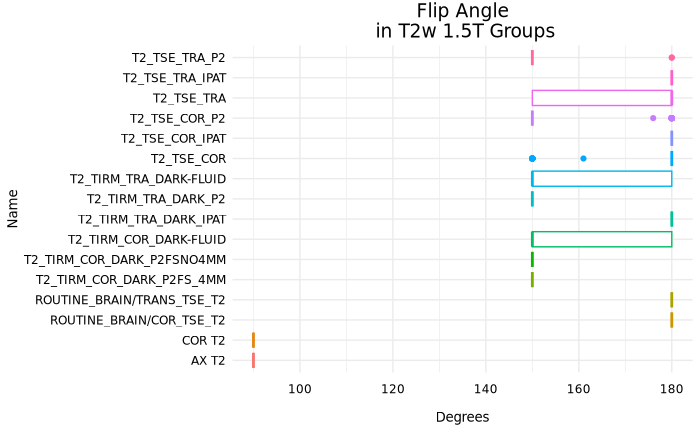
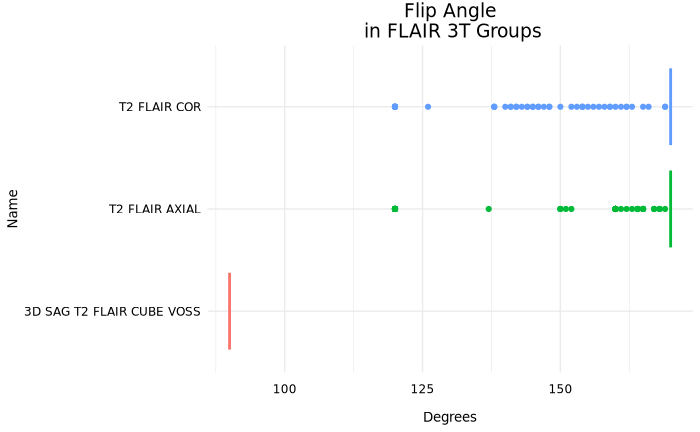

##### PixelBandwidth
##### PercentSampling
##### MultibandAccelerationFactor

---

## Dictionaries
### Reconstruction Methods
* BIDS pair: `rec-<value>`
* Values:
    * [PROPELLER](https://mriquestions.com/propellerblade.html)
    * NORM
    * DIS2D
    * DIS3D
    * MFSPLIT
    * FIL 

### Sequences
* BIDS pair: `acq-<value>`
* Values:
    * [MPRAGE]()
    * [TSE]()
    * [GE]()
    * [SE]()
    * [HASTE](https://mriquestions.com/hastess-fse.html)
    * [SSFSE](https://mriquestions.com/hastess-fse.html)
    * [SPACE](https://mriquestions.com/spacecubevista.html)
    * [CUBE](https://mriquestions.com/spacecubevista.html)
    * [VISTA](https://mriquestions.com/spacecubevista.html)
    * [VIBE](https://mrimaster.com/characterise-image-vibe/)
    * [TIRM DARK]()
    * [FL2D](https://www.ncbi.nlm.nih.gov/pmc/articles/PMC4588759/)
        >2-dimensional fast low angle shot (FLASH; Siemens) is equivalent  to the spoil gradient recalled echo (SPGR; GE) or T1-fast field echo  (FFE; Philips), fast field echo (FastFE; Toshiba), or the radiofrequency  spoiled steady state acquisition rewound gradient echo (RSSG; Hitachi). 
    * [FL3D]()

---

## Helpful Resources
### Vendor Specific Guides
#### Siemens
* [What is a nifti?](https://brainder.org/2012/09/23/the-nifti-file-format/)
* [Syngo DICOM Conformence Statement](scan_identification/siemens_syngo_info.pdf)
* [FSPGR With IR Prep](https://mriquestions.com/ir-prepped-sequences.html)

## References

Last updated 2024-09-05 by dabrielz